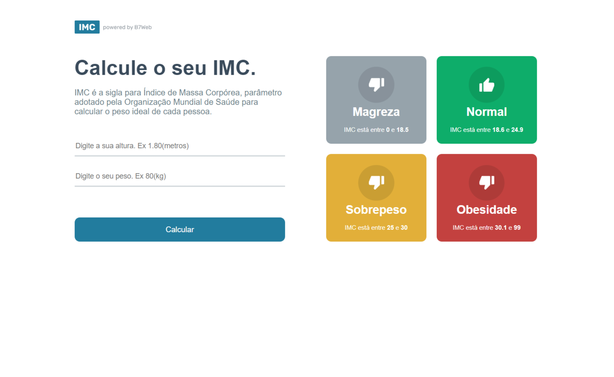

# Calculadora de IMC

Projeto em React + Typescript fazendo uma calculadora de IMC.

Projeto desenvolvido durante o curso [b7web](https://b7web.com.br)

### Instalação
- `npm install`

### Para Rodar
- `npm start`

# BMI (Body Mass Index) calculator

Project in React + Typescript making a BMI calculator.

Project developed during the course [b7web](https://b7web.com.br)

### Installation
- `npm install`

### To Run
- `npm start`

### Screenshot

### Links

- Solution URL: [ Jonathan Ribeiro - Github](https://github.com/jowribas/url-shortening-api-master)
- Live Site URL: [BMI Calculator] ()